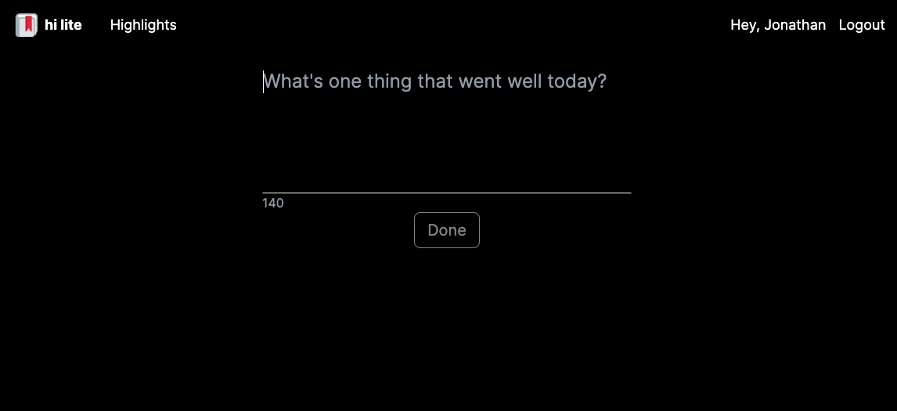
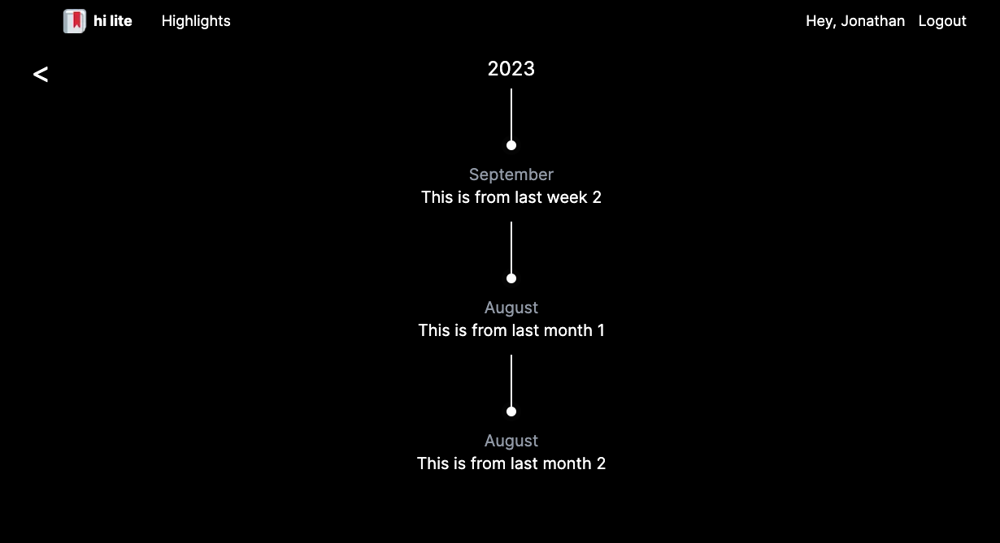
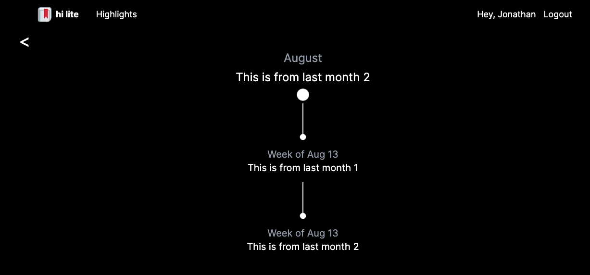

# 🔖 hi-lite API

Express server for a web app designed to help bring more awareness to the best parts of your day. It works by collecting a quick text blurb about each highlight throughout your day, and at the end of the day, prompting you to select your favorite one. Then, at the end of every week, hi-lite will prompt you to select the highlight of your week from that week's daily highlights. Rinse and repeat for the month (from weekly highlights) and year (from monthly highlights). hi-lite will then store these memories in the highlights section, where you can drill down into each individual period of time to remember highlights!

The client for this app can be found [here](https://github.com/jn222/hi-lite).

## Demo

Client: https://hi-lite.vercel.app/

Server: https://hi-lite-api.onrender.com/


## Screenshots







## Tech Stack

[**Client:**](https://github.com/jn222/hi-lite) NextJS [(App Directory)](https://nextjs.org/docs/getting-started/project-structure), React, [TailwindCSS](https://tailwindcss.com/), [Zustand](https://github.com/pmndrs/zustand), Jest

**Server:** Node, Express, [Prisma](https://www.prisma.io/), Jest

**Database:** Postgresql

**Hosting:** [Vercel](https://vercel.com) for client and database, [Render](https://render.com/) for server


## Environment Variables

To run this project, you will need to add the following environment variables to your .env file:

`PORT` - the port to run the server on locally

`DATABASE_URL` - the Postgresql server for Prisma to use. Formatting details can be found [here](https://www.prisma.io/docs/getting-started/setup-prisma/add-to-existing-project/relational-databases/connect-your-database-typescript-postgresql).

`ORIGIN` - the endpoint of your client. Should default to http://localhost:3000 if running hi-lite out of the box.

`CREDENTIALS` - whether to include HTTPS credentials. Set to true.


## Run Locally

Ensure that you are running a local Postgresql instance, with an environment variable pointing to it specified above.

Make sure to clone and set up the client for this project as well, more details can be found [here](https://github.com/jn222/hi-lite).

Clone the project

```bash
  git git@github.com:jn222/hi-lite-api.git
```

Go to the project directory

```bash
  cd hi-lite-api
```

Install dependencies

```bash
  yarn install
```

Populate the DB using Prisma and generate Prisma models.

```bash
  prisma db push
  prisma migrate deploy # TODO not sure if this is needed
  prisma generate
```

Start the app

```bash
  yarn dev
```

Build and start a production build

```bash
  yarn build
  yarn start
```

## Todos

- Put in tests 😭
- Put documentaion comments
- Update API doc
- Localize highlight time ranges on highlight page
- Use [node-cron](https://www.npmjs.com/package/node-cron) to automate cron jobs for autoassigning highlight designations when there is only one for a day/week/month/year
- Find ways to view hanging highlights

## Known bugs

- Check timezone edge cases

## Acknowledgements

This project uses starter code generated by [ljlm0402/typescript-express-starter](https://github.com/ljlm0402/typescript-express-starter). It's a handy tool which comes with a great template for using typescript, and validation and auth middleware for Express!
